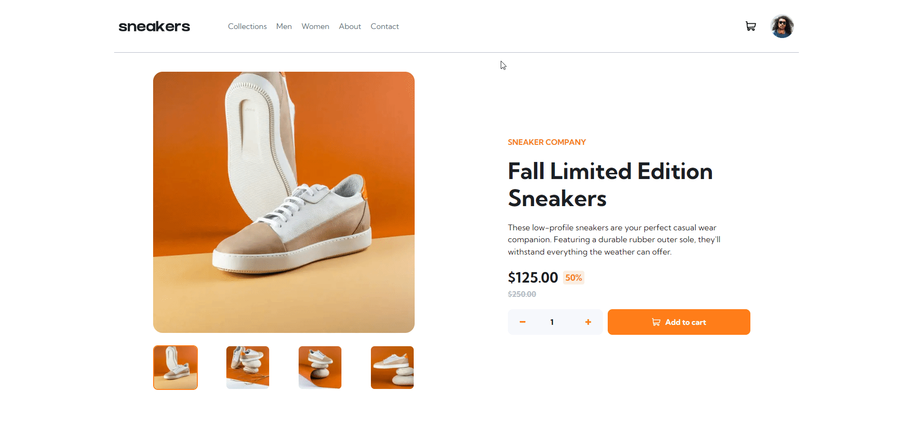

<a name="readme-top"></a>

<div align="center">
  <h1 align="center">Ecommerce Product Page</h1>

  <p align="center">
    This is a Front-end Mentor project, is a Ecommerce Product Page make with Next.js + Typescript
    <br />
    <a href="https://product-page-five.vercel.app/">View Demo</a>
    ·
    <a href="https://github.com/jjuliomarttins/product-page/issues">Request Feature</a>
    ·
    <a href="https://www.frontendmentor.io/home">Front-End Mentor</a>
  </p>
</div>

<ul>
  <li>
    <a href="#preview">Preview</a>
  <li>
    <a href="#technologies">Technologies</a>
  </li>
  </li>
  <li>
    <a href="#getting-started">Getting Started</a>
    <ul>
      <li><a href="#prerequisites">Prerequisites</a></li>
      <li><a href="#installation">Installation</a></li>
    </ul>
  </li>
  <li><a href="#license">License</a></li>
  <li><a href="#author">Author</a></li>
</ul>

## Preview



<br />

## Technologies

- **[Next.js](https://nextjs.org/)**
- **[TypeScript](https://www.typescriptlang.org/)**
- **[SVGR](https://react-svgr.com/docs/getting-started)**
- **[CSS Modules](https://github.com/css-modules/css-modules)**

<br />

## Getting Started

### Prerequisites

- **[Node.js](https://nodejs.org/en/)**
- **[vscode](https://code.visualstudio.com/)**

### Installation

Clone the repository in your computer

```bash
  git clone https://github.com/jjuliomarttins/product-page
```

Install all dependencies with `npm install` or `yarn` and run the project with `npm run dev` or `yarn dev`.

## License

Distributed under the MIT License. See `LICENSE.txt` for more information.

## Author


<br />
<sub><b>Julio Martins</b></sub></a>

Make by Julio Martins 👋🏽 Contact me!

[](https://www.linkedin.com/in/jjuliomarttins/)

<p align="right">(<a href="#readme-top">back to top</a>)</p>
